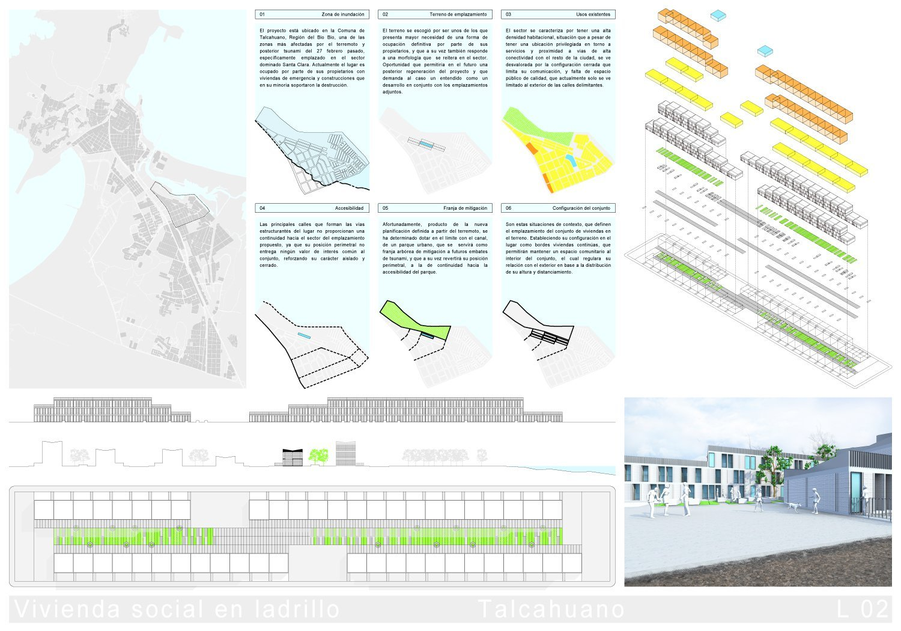
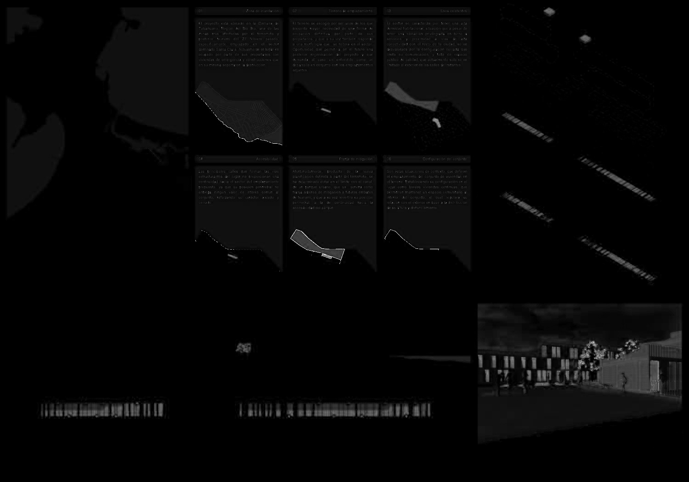
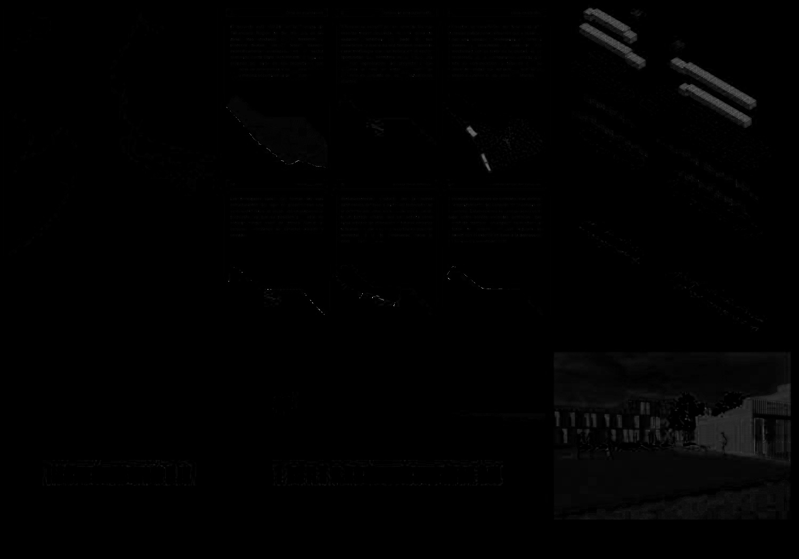
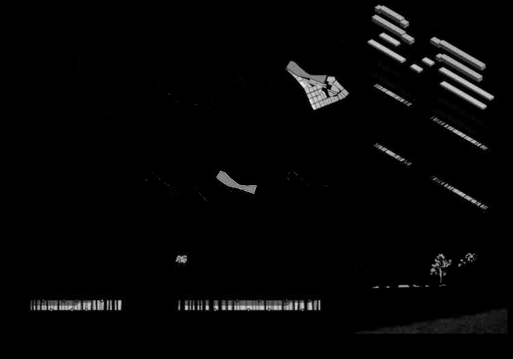
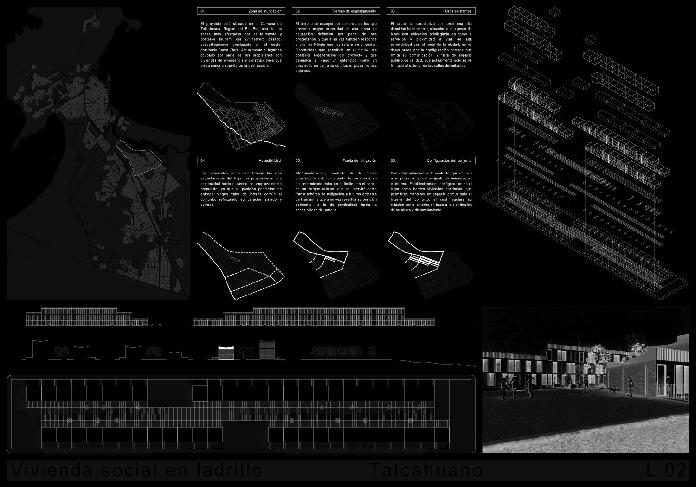

# CMYK Color Coverage Tool

## Background
Recently, I came across a request from a print shop to calculate the color coverage in an image to help them calculate the cost per print.

## Basic steps
1. Convert image from RGB to CMYK
   - Commercial printers will use CMYK (additive) printing over RGB
2. Separate the channels into their components
3. Calculate the area of the image in pixels
4. Calculate the area of non-zero pixels
5. Calculate the coverage in %

The white area coverage is also calculated, but only presented as information since it does not add any cost to the print in CMYK

## Input image

We use the input image found below


## Output Channels
Using the `load_convert_image` method which takes out input, converts the image to CMYK, and returns the split channels.

If we visualize these channels we can see each channel represented in black and white.  Where black is the non-printed area and shades of gray to white are the printed color.

| Channels                                                    |                                                             |
|-------------------------------------------------------------|-------------------------------------------------------------|
| C<br/> | M<br/> |
| Y<br/> | K<br/> |

## Output Coverage
The channel coverage per channel is calculated by finding the number of pixels where each channel is not zero and then dividing by the total area.

In addition to coverage, it's useful to know the intensity of the color to give a measure of how much ink/toner is required  To calculate the intensity, we have to remember that the image reports intensity between `0-255`, but CMYK printers usually operate in percentage `0-100`
To find the average channel intensity, we sum all of the pixels in each channel and divide by the number of non-zero pixels.  Then we need to scale the image by dividing by 255
```commandline
average_intensity = sum_nonzero_pixels/n_nonzero
```
```commandline
Convert to channel %
%_intensity = average_intensity*(100/255)
```

Our output is shown below

| Ch | Ch coverage % | % intensity |
|----|---------------|-------------|
| C  | 33.36         | 7.83        |
| M  | 17.85         | 3.63        |
| Y  | 10.56         | 20.37       |
| K  | 49.25         | 12.92       |

## Conclusion

We have separated the converted an RGB image into CMYK.  We separated the channels and then calculated the coverage and intensity of each color.  We can visually see that the cyan and black channels contain a lot of data from our separated channels, which matches our calculated coverage.  The other channels have fairly low coverage.  Looking at the intensity of the channels, we see that yellow has a very high percentage, which is reflected by the white in the Y channel (as compared to the grays in other channels).  The Black channel's intensity is also relatively high.  We understand this as any lineart and the text of the image.  Overall this can be a tool used to quantitatively price prints based on their content and increase the revenue of a print shop.


